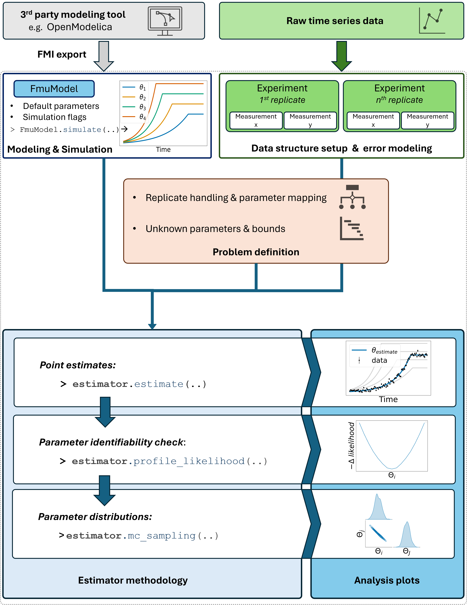
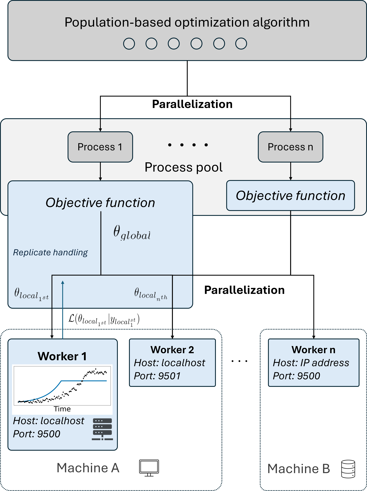

# Summary
Modeling and simulation are essential tools for understanding the complex nature of biological systems and exploiting the information contained in experimental data. Since often model parameters cannot be measured directly, parameter estimation is crucial for creating predictive models that accurately represent the underlying biological processes. We present the Python package $\texttt{estim8}$, an FMI-compliant framework for ODE and DAE (bio)process modeling and parameter estimation with convenient and highly scalable solutions for experimental replicates. The source code is available on [GitHub](https://github.com/JuBiotech/estim8). The package is unit-tested on Windows and Linux. A thorough documentation is available under (https://estim8.readthedocs.io/en/latest/)[https://estim8.readthedocs.io/en/latest/] including various example notebooks.

# Statement of Need
Mathematical modeling has become a pivotal tool in biotechnological research [@RN29] and industrial bioprocess development [@RN27; @RN28] by parametrizing the information gained from experimental data and creating digital twins. While ordinary differential equations (ODEs) are commonly used to describe continuous biological systems, many biotechnological applications require differential algebraic equation (DAE) systems to handle discontinuities, discrete events, physical constraints, and embedded optimization criteria [@RN26].

Parameter estimation is crucial in this context, as many model parameters cannot be determined a priori and must be estimated. This is commonly addressed by "fitting" the model to experimental data. Although several general-purpose software tools for simulation and parameter estimation exist, they currently have significant limitations: Many only support ODE systems [@RN30; @RN33; @RN34; @RN31], require substantial workarounds for biological problems [@RN35; @RN36], or depend on proprietary MATLAB licenses for DAE simulation [@RN32].

To address these limitations, we present $\texttt{estim8}$: a Python-based toolbox for simulation and parameter estimation of dynamic models. It is built on the Functional Mock-up Interface (FMI) standard and employs metaheuristic algorithms for optimization problems. $\texttt{estim8}$ provides specialized functionality for biotechnological applications, particularly in handling experimental replicates. By supporting model definition and simulation export from various FMI compliant third-party software, including the open-source OpenModelica platform [@RN22], $\texttt{estim8}$ enables comprehensive DAE support and convenient event handling.

# Materials and Methods

## Implementation
$\texttt{estim8}$ is an open source Python package compatible and tested with Windows and Linux/Unix platforms. It comprises 10 modules: `estimator`, `models`, `datatypes`, `error_models`, `workers`, `generalized_islands`, `objective`, `optimizers`, `utils` and `visualization`. The modular, object-oriented architecture allows for easy expansion by new implementations, like e.g. custom simulators or cost functions. At the very core, $\texttt{estim8}$ currently features interactive simulation of Functional Mock-up Units (FMUs) via the ModelExchange or CoSimulation interface in Python utilizing FMPy [@RN14]. Parameter estimation and functionality for uncertainty quantification employ a broad range of optimization algorithms provided by the packages SciPy [@RN15] and pygmo [@RN21].

# Results and discussion
## Workflow
The workflow in $\texttt{estim8}$ follows a structured approach to bioprocess modeling and parameter estimation (Figure 1). Users begin by developing mathematical models using third-party software that supports the FMI standard, such as OpenModelica [@RN22]. This open-source platform provides an interactive modeling environment with graphical capabilities and enables the export of models as Functional Mock-up Units (FMUs), supporting both CoSimulation and ModelExchange formats. Noteworthy, models of the SBML [@RN40] standard can be translated to Modelica [@RN11], further enhancing the scope of modeling tools supported in $\texttt{estim8}$.

The exported FMU is then integrated into $\texttt{estim8}$ using the $\texttt{FmuModel}$ class. The package implements a structured data hierarchy where $\texttt{Experiment}$ objects contain $\texttt{Measurement}$s, associated $\texttt{error\_models}$, and $\texttt{observation\_mapping}s$ . A key feature of $\texttt{estim8}$ is its comprehensive handling of biological replicates, which are crucial for ensuring statistical quality in biological experiments [@RN37]. The package accounts for varying conditions between replicates, such as different experimental conditions, through model replicates that can share global parameters while maintaining replicate-specific local parameters based on a user-defined $\texttt{ParameterMapping}$.

At the core of $\texttt{estim8}$ is the $\texttt{Estimator}$ class, which serves as a central hub for managing parameter estimation tasks. This class
stores all user input data and provides the functionality for parameter estimation. Identifiability analysis and uncertainty quantification are approached through profile likelihoods and Monte Carlo sampling respectively. The `visualization` module includes comprehensive visualization methods for analyzing simulation results, comparing model predictions with experimental data, and evaluating parameter estimation outcomes. A thorough guideline is given by example notebooks in our [documentation](https://estim8.readthedocs.io/en/latest/).

__Figure 1__: Schematic overview of the $\texttt{estim8}$ workflow.

## Scalability

Parameter estimation requires numerous simulation steps for evaluating a candidate solution $\theta$ by comparing the resulting model predictions to experimental data based on a statistical likelihood measure $\mathcal{L}$. This evaluation procedure – commonly referred to as the _objective function_ – in most application cases is the time-determining step for total estimation time.
Many population-based solvers therefore enable parallel evaluations of the objective function, especially the pygmo package allows for highly parallelizable setups.

Integrating experimental replicates however dramatically increases the number of simulations, as the objective function for a global parameter set $\theta_{global}$ is now a differentiable function given by the sum of replicate specific likelihood measures:
$$
\mathcal{L}(\theta_{global}|y_{global}) = \sum_{i=1}^{n}{\mathcal{L}(\theta_{local_{i}}|y_{local_i})}
$$

For this matter, $\texttt{estim8}$ provides the option to use a so-called federated computing setup (Figure 2), which effectively introduces an additional parallelization layer. Using pytensor-federated [@RN23], the computation of differentiable objective functions is distributed via gRPC streams to federated worker nodes which carry out the simulation tasks. The worker nodes can therefore be launched on different machines, which allows for massive parallelization of computationally intense task utilizing computer clusters for example.

{width="75%"}

__Figure 2__: Federated computation setup for differentiable objective functions.

### Author contributions
$\texttt{estim8}$ was conceptualized by DS, SN and TL.
Software developments were conducted by TL and DS.
The original draft was written by TL, editing and review was done by SN.
The work was supervised by SN and funding was acquired by SN and WW.

### Acknowledgements
The authors thank Michael Osthege for his advice on software development, and Niels Hollmann and Marijke Rudolph for application tests on real-world problems.

### Competing interests
No competing interest is declared.

# Bibliography
